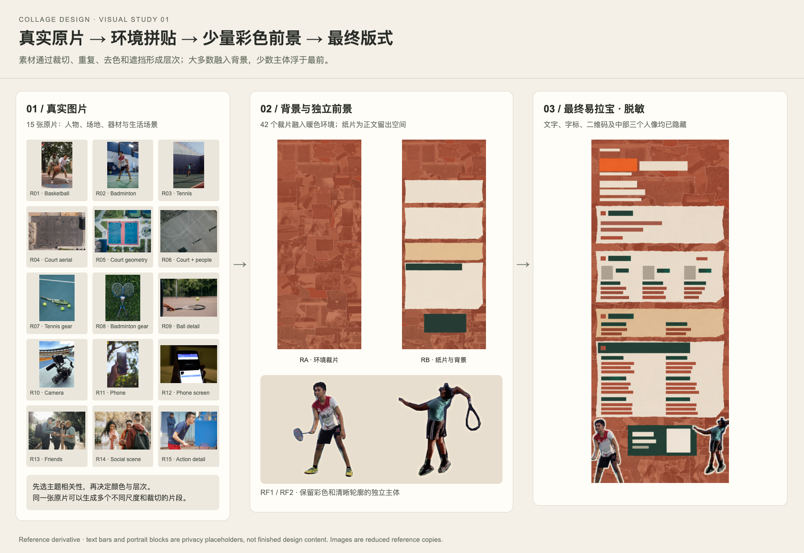
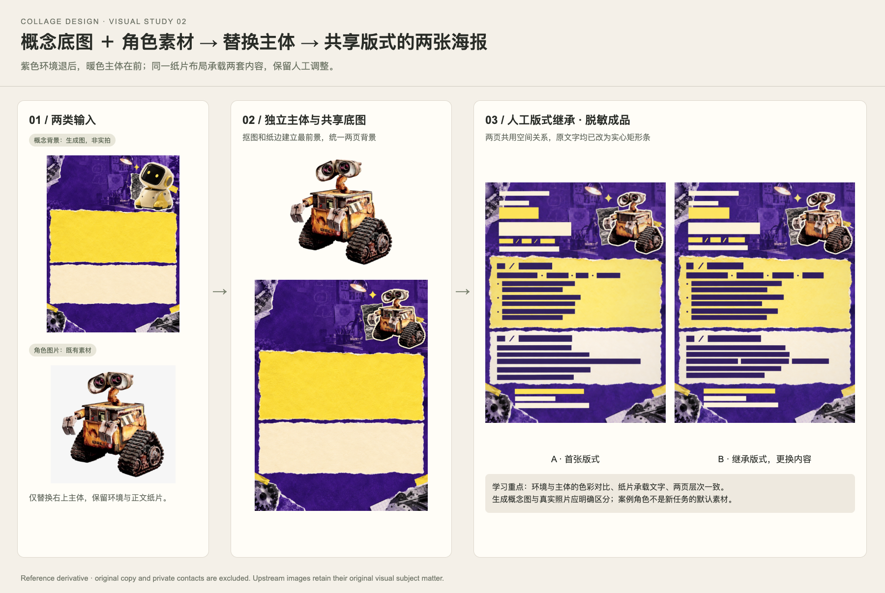

# Collage Design

An agent skill for creating editable photo collages, posters, roll-up banners, and social media graphics in **Canva or Figma**.

Choose a design goal and platform, provide the copy, and optionally suggest a palette. The agent searches for real images, develops the collage and colors, arranges editable text in the selected platform, and responds to later revision requests.

When running in Codex with built-in image tools available, the skill can also use the host's image generation and editing models for collage visuals, paper textures, concept backgrounds, and targeted revisions. It follows the available `imagegen` skill and current tool schema rather than requiring a fixed model version. The built-in route needs no separate API key.

The skill instructions are in Chinese. The agent can follow the language of your request.

## Install with npm / npx

Requires Node.js and npm. Install for Codex:

```sh
npx skills add chanchanpin-official/collage-design --skill collage-design --agent codex --global
```

This uses the [Skills CLI](https://github.com/vercel-labs/skills) from npm to install the skill from this GitHub repository. There is no separate npm package named `collage-design`.

Omit `--global` for a project-level installation. Omit `--agent codex` to choose another supported agent; tool availability and compatibility must be checked in that host.

To inspect the available skill without installing:

```sh
npx skills add chanchanpin-official/collage-design --list
```

## Requirements

- A connected and authorized **Canva or Figma connector** with the capabilities needed to create and edit the target design. Only the selected platform is needed for a task.
- Host-provided web and image search for sourcing real photographs independently of either platform's asset library.
- A way to prepare and upload image assets supported by the host and chosen connector. Image operations must follow the host's tool instructions.

Installing this skill installs instructions only. It does not install connectors, sign in to an account, grant permissions, or provide paid platform access. Connector features and approval rules depend on the current tool schema.

## Visual references

The skill includes redacted roll-up and poster studies with their source and intermediate images. Text and private identifiers are masked; unredacted originals are excluded.

The examples illustrate real-image selection, monochrome/color hierarchy, foreground subjects, and material relationships. Generated concept imagery is identified separately.





Read the [visual examples](skills/collage-design/references/visual-examples.md), [selection and layering decisions](skills/collage-design/references/composition-decisions.md), and [image source index](skills/collage-design/references/visuals/sources.md). The redacted studies are visual references, not pixel-exact masters; their bars are not content to copy into a new deliverable.

## Usage

Invoke `$collage-design` with the output format, Canva or Figma, and the text to include. Add dimensions, a palette, or an existing design when relevant.

## Workflow

1. Define the output: format, size or publishing placement, number of pages, and purpose. Physical dimensions use cm; screen graphics use aspect ratios and pixels.
2. Choose Canva or Figma, freeze that route, and check the connector. A tool failure does not authorize switching platforms.
3. Organize the supplied copy into heading levels, body text, calls to action, and supporting information.
4. Use the optional palette or derive one from the subject and selected photographs.
5. Search for real images using generic subject terms, inspect their sources and usage terms, and prepare the collage assets. In Codex, use available image generation or editing tools where appropriate to the task; respect real-photo-only and pixel-preservation requirements, and label generated material accurately.
6. Compose the design in the selected platform, preserve editable text, inspect the preview, and verify saving.
7. Deliver the preview and editable link, plus requested exports. On later feedback, reread the current design and preserve manual edits.

Canva uses available creation or import tools followed by editing. Figma uses uploaded assets and native frames, text, and layers. Existing approved masters take precedence over new layout defaults. If a requested operation is unavailable, explain the remaining adjustment in the same platform.

## Privacy and task files

The package contains reusable instructions and redacted visual references. Real project briefs, conversations, generation prompts, personal preferences, credentials, and private design links belong in private task records.

Store real task briefs, source lists, design identifiers, previews, exports, and handoff records in a separate private project directory. Do not save them back into this package. Use generic search terms instead of confidential wording, and do not publish private assets to make them importable.

## Contents

- [Skill instructions](skills/collage-design/SKILL.md)
- [Design and editing defaults](skills/collage-design/references/preferences.md)
- [Canva workflow](skills/collage-design/references/canva.md)
- [Figma workflow](skills/collage-design/references/figma.md)
- [Assets and handoff](skills/collage-design/references/assets-and-handoff.md)
- [Visual examples and material relationships](skills/collage-design/references/visual-examples.md)
- [Real images, monochrome/color, and foreground selection](skills/collage-design/references/composition-decisions.md)

## License

[MIT](LICENSE). The license covers this skill's instructions and metadata. Included reference visuals have a separate [notice](skills/collage-design/references/visuals/NOTICE.md); third-party photographs and artwork remain subject to their own terms. Images or other assets selected during a task also retain their own terms.
